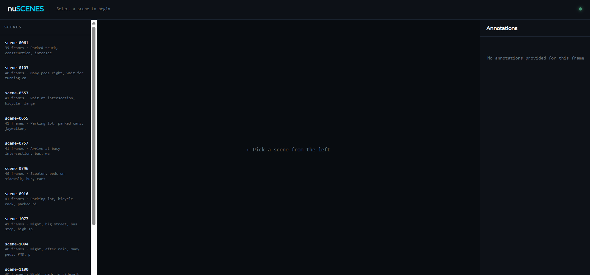
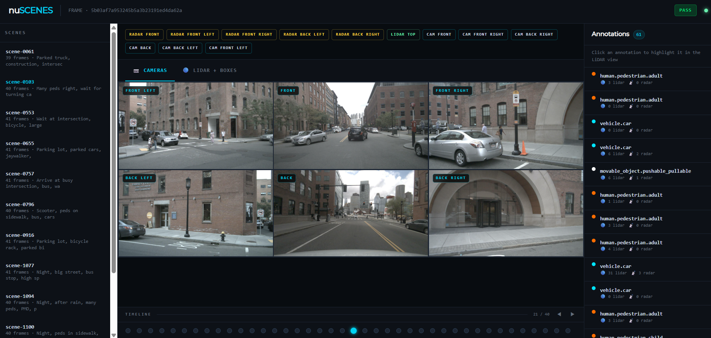
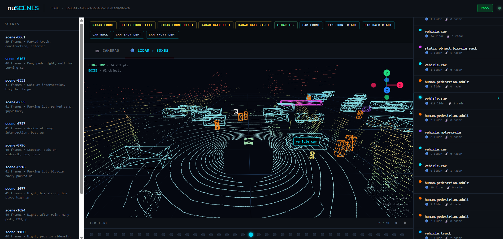
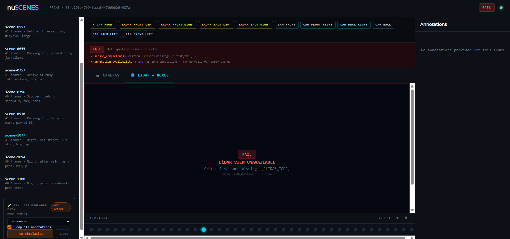

<h1 align="center">LiangDao Assessment</h1>

# Technical Proof for Senior Web Application Developer – NuScenes API & Multi-Sensor Viewer

## Overview

This repository contains a comprehensive technical assessment demonstrating autonomous driving data visualization and API integration. The project combines a **React + Three-three-fiber frontend** for interactive sensor data exploration served by a **FastAPI backend** providing the nuScenes dataset.

The implementation focuses on web computer graphics, clean architecture, type safety, scalability, and seamless integration between backend and frontend components.

## Author

- David Mayorga-Herrera - [Website](https://mayinteractive.io/)

---

## Build

### Frontend Stack
- **Vite** + **React 19** + **TypeScript**
- **react-three/fiber (R3F)** for 3D rendering
- **Three.js** for 3D graphics
- **TailwindCSS** for styling
- **pnpm** as package manager

### Backend Stack
- **FastAPI** - Modern async Python web framework
- **Uvicorn** - ASGI server
- **nuScenes-devkit** - Official dataset SDK

---

### Architecture Decisions: Python Backend Over Node.js

- **Python Backend Over Node.js**: While I have extensive experience with Node.js and JavaScript ecosystems, I deliberately chose **Python with FastAPI** for the backend. This decision reflects architectural pragmatism: the nuScenes dataset and its official SDK are built entirely in Python, making native integration a natural choice. This approach eliminates unnecessary abstraction layers.

---

## Gallery

**1 - Default Viewer**            
  

**2 - Multi-Camera Integration**


**3 - LIDAR Point Cloud + Annotation Boxes**          
  

**4 - Data Quality Errors Visualization**
 

---

## Project Setup

### Requirements

Before starting, ensure you have installed:

- **Node.js** (v18 or higher) and **pnpm** for the frontend
- **Python** (v3.8 or higher) for the backend
- **Linux** or **WSL (Windows Subsystem for Linux)** is recommended
  - On Windows, WSL2 is strongly recommended for better performance with large dataset operations
  - Windows native is not recommended due to file path handling with the dataset

### Download Dataset

1. Create a free account at https://www.nuscenes.org/sign-up
2. Download **nuScenes mini** (v1.0-mini) - ~4 GB
3. Extract all archives into `nuscenes-api/data/nuscenes/`


### Project Structure

```
LiangDao-Assessment/
├── nuscenes-api/                 # Backend
│   ├── main.py                   # FastAPI application
│   ├── config.py                 # Configuration and settings
│   ├── database.py               # nuScenes SDK initialization
│   ├── requirements.txt          # Python dependencies
│   ├── routers/
│   │   ├── scenes.py            # Scene endpoints
│   │   ├── samples.py           # Sample/Frame endpoints
│   │   ├── sensor_data.py       # Sensor data endpoints
│   │   └── quality.py           # Data quality inspection
│   └── data/
│       └── nuscenes/            # ← Dataset goes here
│
└── multisensor-viewer/           # Frontend
    ├── src/
    │   ├── components/
    │   │   ├── three/           # 3D renderer components
    │   │   │   ├── LidarViewer.tsx
    │   │   │   ├── PointCloud.tsx
    │   │   │   └── AnnotationBoxes.tsx
    │   │   └── ui/              # UI components
    │   │       ├── SimulationPanel.tsx
    │   │       ├── Timeline.tsx
    │   │       └── SensorChip.tsx
    │   ├── config/
    │   ├── utils/
    │   └── App.tsx
    ├── package.json
    ├── vite.config.ts
    └── tailwind.config.js
```

---

## How to Run

### Backend Setup & Execution

1. **Install Python dependencies:**
   ```bash
   cd nuscenes-api
   python -m venv venv
   source venv/bin/activate  # On Windows: venv\Scripts\activate
   pip install -r requirements.txt
   ```

2. **Start the FastAPI server:**
   ```bash
   uvicorn main:app --reload --host 0.0.0.0 --port 8000
   ```
   - API will be available at `http://localhost:8000`
   - Interactive docs at `http://localhost:8000/docs` with Swagger
   - The dataset will be loaded automatically on startup

### Frontend Setup & Execution

1. **Install dependencies:**
   ```bash
   cd multisensor-viewer
   pnpm install
   ```

2. **Start development server:**
   ```bash
   pnpm run dev
   ```
   - Application will be available at `http://localhost:5173` (default Vite port)
   - Hot module reloading enabled for development

3. **Build for production:**
   ```bash
   pnpm run build
   ```
   - Production build output goes to `dist/`

---

## What I've Developed

### Backend - NuScenes API Service

1. **RESTful API Endpoints** - Complete operations for:
   - Scenes: List all driving scenes, retrieve scene metadata
   - Samples/Frames: Get frame data with associated sensor information
   - Sensor Data: Stream LIDAR point clouds, camera images, RADAR data

2. **Data Quality Inspection**:
   - Validation of sample data integrity
   - Detection of potential issues in dataset structure (timestamp inconsistencies, or missed sensor or annotations data) or with the general use of SDK.

3. **Mocked invalid requests**:    
   - Handling for API robustness simulating cases of lack of annotations or sensor data

### Frontend - Multi-Sensor Viewer

1. **3D Point Cloud Visualization**:
   - LIDAR point cloud rendering using Three.js and react-three/fiber
   - Interactive navigation with OrbitControls
   - Efficient rendering of high-density point data

3. **Simulation Panel**:
   - Scene and sample selection interface
   - Metadata display and scene information
   - Integration with backend API for dynamic data loading

3. **Multi-Sensor Panel**:
   - Interactive sensor chip display showing available data types
   - Quality indicators for each sensor

4. **Timeline Navigation**: 
   - Frame-by-frame playback of scene sequences

5. **Annotation Visualization**:
   - 3D bounding boxes for detected objects
   - Annotation rendering in world space aligned with point cloud

6. **Simulation Degraded Data Panel**:
   - Options to drop annotations or radar data and how to display the errors to the user.

7. **Type-Safe Implementation**:
   - Full TypeScript coverage with strict mode
   - Code quality validation with Eslint and Prettier

---

## Development Notes

- **Communication**: Backend runs on port 8000, frontend on 5173
- **3D Rendering**: All 3D operations are GPU-accelerated using Three.js
- **State Management**: React hooks for clean, functional component architecture
- **AI-assisted development**: Claude, NotebookLM and GitHub Copilot were used to summarize documentation of Python and nuScenes and accelerate implementation.
- **Invalid Data in Frontend**: Simulated panel in frontend app is rendered in frontend due to assessment requirements. It would not be rendered in production for real customers.

---

## What I Would Add With More Time

- Unit and integration tests (@react-three/test-renderer)
- Customized visualization of radar sensor showing PCD data 
- Advanced interaction in LiDAR Panel: Click on Boxes and set as selected in Annotations panel.
- Optimize TailwindCSS classes saving repeated values of colors and margins, among others to variables provided by Tailwind or created as own theme.

---

## Notes

This technical proof prioritizes:
- **Code clarity** through modular, well-organized components
- **Type safety** with full TypeScript coverage
- **Scalability** with extensible backend routers and frontend components
- **Integration** with seamless frontend-backend communication
- **Best practices** in both Python (FastAPI) and TypeScript/React ecosystems
